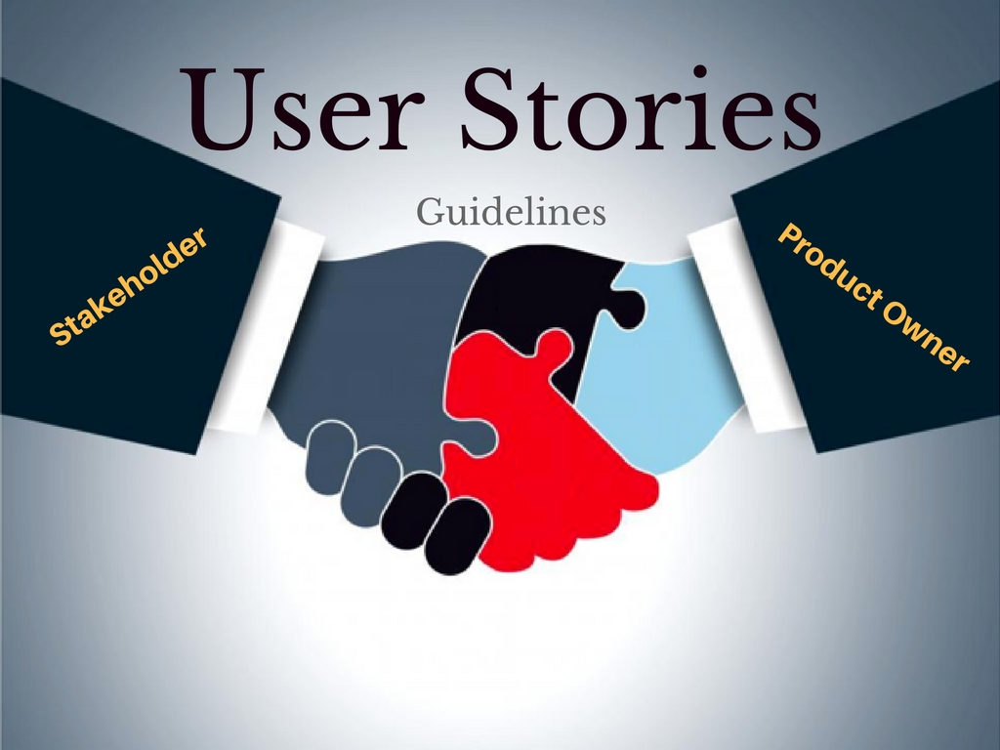

# 敏捷的用户故事方法

人的大脑同时处理事物的能力是有限的，传统的产品`PRD`既要思考内容是否表述了产品的真实意图，还要想着符合公司对于格式、用词等等方面的要求，这是一件非常烦琐、心生厌烦的事情。更何况在写的同时还总是回响着一个声音：“这东西写出来有人看吗？”

在维基百科上对用户故事是这样描述的：

> 使用用户故事的目的，以更快的速度、更少的消耗应对现实世界需求的快速变化。

但是，我们使用用户故事，不仅仅是为了快。

从大脑的认知的角度来看，面对同样一个主题，通过多种不同的方式、不同活动的刺激，大脑才能深刻的理解和记忆。

著名的极限编程创始人之一`Ron Jeffries`提出了`3C`原则：

- Card: 使用卡片记录用户故事，一方面可以隐藏底层细节，另一方面也方便各方人员在白板上将其移动，以整体图形的方式将与客户需求有关的内容深深印在团队脑海中，更不用说这样给项目规划带来的好处。
- Conversation：对话是为了促进团队与客户之间的沟通，让大家谈论需求，大声说出来，这种活动也调动了大脑不同区域，让人们能把相关内容学的更快，记得更牢，同时还促进团队和客户之间的沟通，加强人际联系。
- Confirmation：用户故事确认则是以反复的方式，与用户确认某个具体使用场景中的关键细节，从而不会导致遗漏。

一个好的用户故事，应该符合上述的`3C`原则。

另外，用户故事、计划会议等类似非技术实践，实施起来可能并不复杂，但是必须要结合`TDD`、持续集成、重构等技术实现，否则想要产生高质量的代码就是空谈。
