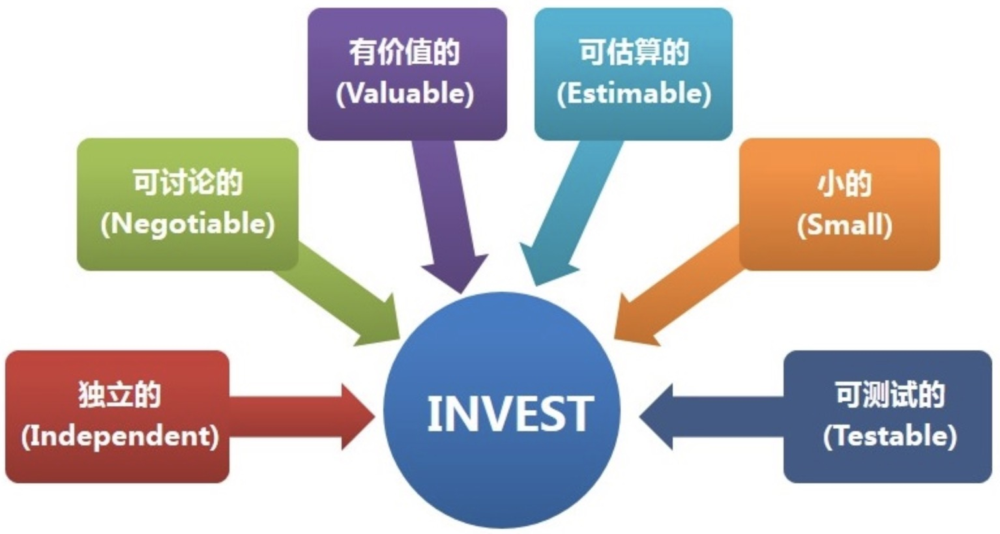

# 2. 编写故事

**用户故事(`User Story`）是从用户角度对功能的简要描述。**

可以使用如下用户故事格式：

> 作为一个<**角色**>，可以<**活动**>，以便于<**价值**>。

- 角色： 谁要使用这个功能？
- 活动： 需要执行什么操作？
- 价值： 完成操作后带来什么好处？

为了构造好的故事，我们关注**六个特征**。

一个优秀的故事应该具备以下特点：

- 独立的(`Independent`)
- 可讨论的(`Negotiable`)
- 对用户或客户有价值的(`Valuable to Purchasers or Users`)
- 可估计的(`Estimatable`)
- 小的(`Small`)
- 可测试的(`Testable`)

> 《探索极限编程》和《重构工作手册》的作者`Bill Wake`，建议用英文缩写`INVEST`来代表这六个特征。