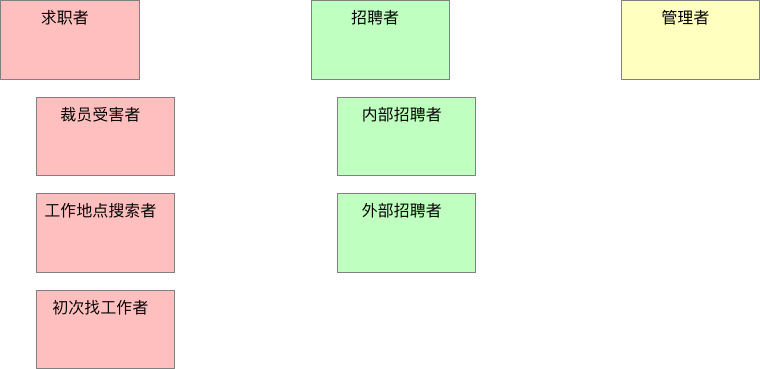

# 3.2. 角色建模的步骤

我们将使用下面的步骤来**识别、选择有用的用户角色集合**。

### 1. 通过头脑风暴，列出初始的用户角色集合

为了识别用户角色，客户和开发人员（多多益善）聚集在一个房间里，房间里要有一张大桌子或一堵墙，这样他们就有地方粘贴或固定卡片。

理想情况是在项目启动时，把团队所有成员聚集在一起进行用户角色建模，但这并不是必须的，只要有一定数量的开发人员和客户一同参与，会议往往能取得成功。

每个参与者从桌子中间堆放的记录卡中取出一叠（即打算用电子文档来记录用户角色，也应该从手写记录开始）。每个人先在卡片上写下角色名称，然后把他们放在桌子上，或者贴在墙上。

放上新的角色卡片后，作者只说出新角色的名字，不做其它任何事情。这个会议只做头脑风暴，无需对卡片进行讨论，也不需要对角色进行评估。

每个人要做的至少尽量在卡片上写出自己想到的角色。不需要让大家轮流给出新的角色。想到一个新角色就把它写到卡片上。

在头脑风暴过程中，房间里会充满书写卡片的声音，偶尔夹杂着放置新卡片或朗读角色名称的声音。这样继续下去直到大家没有新的进展，并且很难再相出新的角色。

尽管此时有可能还没有找到所有的角色，但其实已经很接近了。这样的头脑风暴很少会超过15分钟。

> 一个用户角色是一个用户

对项目的角色进行头脑风暴时，要坚持“**已确认的角色代表的是单一用户**”的原则。

### 2. 整理最初的角色集合

接下来需要**整理**这些角色了。

在桌子上或墙上移动卡片的位置，以表明角色之间的关系。对于有重叠的角色，把它们对应的卡片也重叠到一起。如果角色只有一点点重叠，那么卡片也只重叠一点点。如果角色完全重叠，那么卡片也完全重叠。

> 上面的图中显示了这样的角色之间的关系

- “大学毕业生”和“初次找工作者”，他们的角色有显著的重叠
- 其他将使用工作搜索功能的人而言，它们的角色卡片也有较小但类似的重叠
- “监视者”的角色卡片与其他卡片仅仅稍有重叠，因为这个角色代表的是那些对现有工作相对满意的人，但他们同时有喜欢留意好的机会
- 右侧角色是“工作发布者”、“招聘人员”和“简历阅读者”的角色卡片，由于“招聘者”既需要发布招聘广告，也会阅读简历
- “管理者”角色也在其中展示，这个代表这个招聘网站的内部用户，他们要支持这个网站的运营

#### 系统角色

尽量坚持一个原则：**用户角色定义的是人，而不是其他外部系统**。如果觉得有必要，可以偶尔引入一个非人物的**系统角色**(non-human user role)。然而，确认用户角色的目的是确保我们很周到的为用户考虑，我们要绝对的、积极地让用户对新系统感到免疫，我们不需要为每一个可以想到的系统用户简历角色，但需要那些能影响项目或成败的角色。

由于其他外部系统很少回事我们系统的购买者，它们很少能决定我们系统的成败。

不过，事情总有例外，如果觉得加入一个非人物的系统就是有助于思考系统，将它加入也未尝不可。

### 3. 整理角色

在角色分组完成后，需要试着**整合和合并**角色了。可以从完全重叠的卡片入手。

首先，这些卡片的作者描述一下他们的角色名究竟代表什么，在简短的小组讨论之后，再判断这些角色是否等同。如果等同，那么这些角色要么合并成单一的角色（也行可以根据这两个初始的角色名去一个新的名字），要么丢弃掉其中一张角色卡。

从[整理最初的角色集合](#2-整理最初的角色集合)的图中可以看到“大学毕业生”和“初次找工作者”这两个角色有很大重叠，基本这两个角色的故事都是相同的，所以决定丢弃“大学毕业生”角色卡。

虽然“初次找工作者”、“裁员受害者”、“工作地点搜索者”和“求职者”有显著的重叠，但是还是决定留下它们，是因为这些角色**每个都代表了系统需要满足的重点方面**。这些角色也使得网站的目标也有微妙的不同，这很重要。

图的右侧，小组认为**区分“简历发布者”和“简历阅读者”没有什么价值**。所以决定，**“招聘者”这个角色会充分覆盖另外两个角色**，所以这两个角色的卡片被抛弃。然后小组觉得内部招聘者（为某个公司工作）和外部招聘者（为任何公司寻找合适的人选）有所不同。他们为内部招聘者和外部招聘者都写了新的卡片，并将这两个角色当成招聘者角色的特殊版本。

除了需要合并重叠的角色外，小组还应该**丢弃那些对系统成功不太重要的角色卡**。例如，“监视者”角色卡代表了哪些只关注工作市场的人，他们可能好几年都不换工作。即使不关注这样的角色，网站也能做的很出色。

他们认定**最好能关注那些对公司成功更重要的角色**，比如“求职者”和“招聘者”角色。

**最终整理的角色卡组合**

### 4. 提炼角色

一旦我们整合好角色，并对角色之间的关系有了一个基本的了解，就可以能通过**给每个角色定义一些特征来建立角色的模型**。

**角色特征是关于同属于这一类的用户事实或者有用信息。**

这里有一些适用于任何角色建模的角色特征：

- 用户使用软件的频率
- 用户在相应领域的知识水平
- 用户使用计算机和软件的总体水平
- 用户对当前正在开发的软件的熟悉程度
- 用户使用该软件的总体目标。有些用户注重使用的便捷性，有些关注丰富的用户体验，等等。

除了这些标准的特征，应该考虑对于正在开发的软件，是否有意向对描述其用户有帮助的特征。例如，对于我们正在设计的招聘网站，可以考虑某个用户是在寻找全职工作还是兼职工作。

在确定角色的有趣特征时，可以在角色卡片上写下注释。完成后，可以把角色卡挂在团队的公共区域，用来提示团队成员。

|用户角色：内部招聘者|
|--|
|1. 不是很擅长使用电脑，但使用网络相当娴熟。|
|2. 不经常使用该软件，但每次使用强度大。|
|3. 他将阅读其他公司招聘广告，以此选择最好的措辞来完成他们的招聘广告。|
|4. 使用简单很重要，但更重要的是，他学会的东西必须在几个月后能够很容易的回想起来。|
