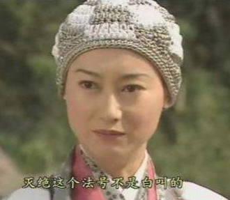

# 两个额外的技术

如果之前描述[用户角色建模](3.2.md)都做完了，已经绝对比99%的其他软件团队多费了心思。大部分的团队确实可以到此为止了。

不过，还有两个额外的技术值得探讨，因为它们**有助于我们考虑某些系统的用户**。当然，我们会在它们**适用于为项目带来明显的好处是才会引入**。

## 虚构人物

识别用户角色是一个伟大的飞跃，但对于有些更为重要的用户角色，再进一步为角色创建一个虚构人物是很值得的。

> 虚构人物是假象的用户角色代表。

创建虚构人物不只是在用户角色上加上一个名字。对于虚构人物的描述应当是十分充分的，让团队的每个人都觉得他们知道这个任务。

例如，之前我们提到“灭绝师太”，她要为她的公司发布工作信息。那她的描述可能是这样：

> 灭绝师太在峨眉派的人事部负责招聘工作，该公司是一个高端网络组件制造商。她已经在该公司工作6年。
> 灭绝师太有弹性的时间安排，每周周五她在家工作。
> 灭绝师太对电脑相当在行，她觉得对于自己所使用的软件产品，她几乎都是超级用户。
> 由于灭绝师太年轻时感情上受过伤害，并且一直忙于工作，40多了还没有结婚，也没有男朋友。她对男性的简历会吹毛求疵，要求很高。
> 由于峨眉派几乎一直在扩张，灭绝师太总是在物色优秀的工程师。
> 由于灭绝师太自以为是电脑行家，她对使用的软件和系统要求都很挑剔，容忍度极低。

假如选择为项目创建虚构人物，要注意，应当**事先做好充分的市场和目标用户群调查**，要确保虚构人物能够**真正代表产品的目标用户**。

我们加上了对灭绝师太的描述，如果有照片就更加生动了，应该找一幅灭绝师太的照片，将它也放入到虚构人物的定义中。

从用户角色或虚构人物的角度描述会使故事变得更加生动。识别出用户角色，并且可能有一两个虚构人物后，就可以开始从角色和虚构人物的视角来说话，而不是宽泛的“用户”。

你可以写一个“用户地点搜索者可以限定他搜索到的工作都在指定的地理区域内”的故事，而不是“用户可以限定他搜索到的工作都在指定的地理区域内”的故事。以这种方式编写的用户故事可以提醒团队想起“杨逍”，他在寻找光明顶的工作。

使用用户角色和虚构故事的名字来编写故事，并不意味着其他角色就不能执行那些故事，而是说明在讨论或实现故事时，用特定的用户角色或虚构人物来思考问题，总是有一些好处的。

## 极端人物

`Djajadiningrat`和其他合著者（2000）提出了第二种可以考虑的技术：**考虑新系统的设计是，使用极端人物。**

他们用设计`PDA`（掌上电脑）作为例子。他们建议不要只为一个典型的穿着考究、驾驶宝马的管理顾问做设计，系统设计师应该考虑那些有鲜明个性的用户。具体来说，作者建议为毒贩、教皇和穿梭多个男友之间的女子设计`PDA`。

考虑极端人物很可能会让你编写出原表可能遗漏的故事。例如，很容易想到毒贩和有多个男友的女子都想要维护多份单独的时间表，以防被警察或男友看见。教皇可能没有那么多保密需求，但可能想要更大字号的字体。

使用极端人物可以导致新的故事产生，但是很难事先确定是否应该讲哲学故事包含在产品中。当然，在极端人物投入大量时间也是不值得的，但是你可以尝试一下这两个方法。至少，你可以花几分钟去考虑一下教皇如何使用你的软件，这可能会带来一到两个灵感。
