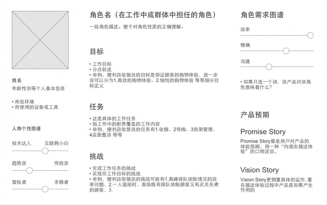

# 用户角色建模

在很多项目中，需求分析人员值守从一个角度来写用户故事， 这样往往会忽略一些需求（故事），因为有些故事针对的不是系统的一般用户。

以用户为中心的设计(`user-centered design, Constantine and Lockwood, 1999`)和交互设计(`interaction design, Cooper, 1999`)的规则使我们懂得，在编写故事前识别用户角色和虚构人物(`persona`)有很多好处。

我们接下来将要讨论如何利用用户角色、角色建模、角色映射和虚构人物这些初始步骤来编写更好的故事，开发更好的软件。

## 扩展阅读

- [User-Centered Design](http://www.e-learning.co.il/home/pdf/4.pdf)
- [Notes on User Centered Design Process (UCD)](https://www.w3.org/WAI/redesign/ucd)