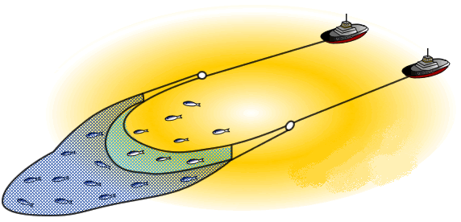

# 引出和捕捉是不合用的

一些需求相关的书中用到了像“引出”(`Kovitz 1999`; `Lauesen 2002`; `Wiegers 1999`)和“捕捉”(`Jacobson`, `Booch`和`Rumbaugh 1999`)这样的词来描述识别与确认需求的实践。

不过这样的术语给我们一种**错觉**：“需求本来已经存在了，我们只要让客户给我们解释需求，然后把它们锁到一个笼子里就可以了。”很多需求并不容易想到。同样，**用户并不知道所有需求**，所以不能单纯依靠引出(`elicitaion`)。

我们可以用另外一个词--**拖网**(`trawling`)这个词来描述收集需求的过程。怎么理解呢？**要像“拖网渔船捕捞鱼”那样收集需求**。

为什么要用这样的比喻呢？理由如下：

- 首先，**不同大小的网用来捕获不同大小的需求**。第一遍，我们可以用大网眼的渔网捞一遍需求池，以此得到所有的大需求。通过大需求，形成对产品的整体感觉。接下来，用网眼小一些的渔网得到中等大小的需求，展示还不用顾及到那些小需求。在这个比喻中，**大小可以是对此产品的商业价值高低或必要性程度**等。

-  其次，拖网表达了另一个含义:**需求会像🐟一样，会生长，也可能会死亡**。今天渔网可能会漏掉一个需求，因为这个需求对于系统来说不重要。但是，根据每轮迭代的反馈，系统会朝着事先不可预知的方向发展，有些需求会变得越来越重要。同样，有些曾经被认为重要的需求，重要性可能会降低，有时甚至降低到我们认为这些需求已经无效了。

- 第三，正如在**某些区域拖网捕鱼不可能捕到所有的🐟，我们也不可能捕捉到所有的需求**。另外，在拖网捕捞需求的时候，也可能捞到一些废弃的货物或漂浮的残骸，他们使需求膨胀。

- 最后，这个拖网捕捞需求的比喻还说明了一个重要的现实：**技能也是发现需求的一个要素**。一个熟练的需求分析人员（`requirements trawler`）知道要到哪里去找需求，而不熟练的需求分析人员只会用低效的方法或在错误的地方浪费时间。

那我们接下来看看有哪些更有效“捞”到用户故事的方法。