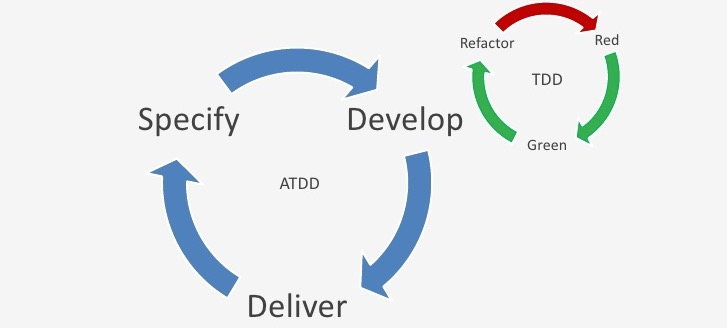

# 6. 用户故事验收测试

**写验收测试的好处有很多，其中之一就是很多客户和开发人员讨论的很多细节可以通过验收测试记录下来**。

比起写冗长的需求列表，像“系统应该...”，可以用测试来充实很多用户故事的细节。

整理验收测试是基本是两步流程：

- 第一，将测试要点记录在故事卡的背面，任何时候发现新的测试，都可以记录到故事卡的背面
- 第二，将测试要点变成全面的测试，这些测试可以用来演示故事已正确、完整的实现

比如，一个记录在故事卡背面的测试要点的例子，“公司可以用信用卡支付发布工作的费用”，这个故事卡的背面可能一下这些测试要点：

- 用Visa信用卡、万事达信用卡和运通卡测试。（通过）
- 用大莱卡测试。（失败）
- 用正确的、错误的和空的卡测试
- 用过期的信用卡测试
- 测试不同的交易金额（包括超出信用卡额度限制）

这些测试要点记录了客户提出的一些假设。

> 假定在招聘网站的例子中的客户写了一个故事“求职者可以查看指定工作的详细信息”。
>
> 客户和开发人员讨论这个故事，确定一些需要显示的一些工作信息 -- 职位名称，描述，工作地点，薪水范围，如何申请等等。
>
> 然而，可以了解并不是所有公司都会提供所有这些信息，所以他希望网站能够自动处理未填的数据。
>
> 比如，没有提供薪水信息，客户甚至不希望提供“薪水范围”标签出现在屏幕上。
>
> 这应该在一个测试里反映，因为程序员可能会假定系统发布工作模块要求所有工作都提供薪水信息。

**验收测试也提供了确认故事是否被完整实现的基本标准**。有了这样的标准，我们就知道什么时候某件事算是做完了，这是避免了花太多或太少的时间和精力的最好方法。

> 举个生活的例子，我妻子烤蛋糕时，她的验收标准就是在蛋糕里插一根牙签。如果牙签拿出来是赶紧的，那么蛋糕就算是做好了。
> 而我则是将手指插入蛋糕，然后尝尝，以此来验收测试她做的蛋糕。

## 6.1. 在写代码之前写测试

**在开始编写故事代码之前，验收测试可以为程序员提供大量有用的信息**。

> 例如，想想“测试不同交易金额（包括超过信用卡额度限制）”。

> 如果在程序员开始写代码前写了这个测试。它会提醒程序员处理因信用额度不够导致交易失败的情况。

> 如果没有看到这个测试，有些程序员就会忘记支持这种情况。

显然，为了让程序员尽早了解这些信息，**应当在为这个故事编写代码前就开始制定验收测试**。

一般在下面这些时候写测试。

- 开发人员和客户**讨论故事且需要记录明确细节时**
- 在迭代开始时，**在写代码前作为一项专门的任务**
- 在开发中或之后的**任何时候发现新的测试时**

**理想状况下，在客户和开发人员讨论故事的时候，他们把细节都写成测试**。

在迭代的开始时就要过一遍所有故事，写一些能想到的测试。比较好的做法是，考虑每个故事，然后问一些类似下面的问题。

- 关于这个故事，**程序员要知道什么**？
- 对于**怎么实现**这个故事，**我的想法是什么**？
- 有没有**一些特殊情况会使用这个故事有不一样的行为**？
- 这个故事**什么情况下会出错**？

下面有一个真实项目的例子，一个扫描软件的故事。

这个故事的作者清晰知道他的期望。

> 例如： 在一个新的文档中打开新扫描的页面，即使软件已经打开了一个文档。
>
> 这个例子中，这个期望被作为故事的一部分卸载卡片的正面。我们也可以轻松的将这个期望作为卡片背面的第一个测试。重要的是，在程序员开始实现这个故事前，通过故事卡片可以了解这个期望。
> 
> 否则，程序员很有可能写出不一样的软件行为，如将新扫描的页面插入到当前文档。

那如果我们有了这样清晰的期望，我们应该**告诉程序员你的期望**。

比如，我们可以这样描述我们的期望。

> 用户可以扫描页面并将其插入新的文档。如果已经打开一个稳定，那么程序应该提示用户并关闭当前文档。

## 6.2. 客户定义测试

既然软件时用来实现用户的愿景，验收测试当然就应当由客户来定义。

客户可以和程序员和测试人员合作创建测试，但是**客户至少应该给我们详细指出一些测试，用以验证故事的实现是正确的**。

另外，一个开发团队（特别是有资深测试人员的）经常还会定义其他的测试。

## 6.3. 测试是过程的一部分

最近我和一家公司一起工作，这里测试人员对软件的理解都来自于程序员。

> 程序员为新功能编写了代码，他们向测试人员解释这个功能，然后测试人员严重程序是否表现出所描述的行为。

> 一般情况下，程序都能通过测试，但轮到用户开始使用时，却总出现这样那样的问题。

> **问题当然是出自测试人员总是按照程序员的描述去测试**。如果没有客户或用户的参与，我们不会真正从他们的角度来测试软件。

**测试是开发过程中的一部分，而不是在编码完成后要做的事**，这点对使用用户故事非常重要。

一般情况下，产品经理和测试人员共同负责列出详细的测试。**产品经理带来驱动项目的公司目标的知识；测试人员则带来了怀疑的心态**。

在一轮迭代开始阶段，他们应该一起列出尽可能多的测试。但这还不够，也不是他们每周碰一次就足够了。随着故事细节逐步展现，往往又能找出更多的测试。

## 6.4. 多少测试才算多？

**只要这些测试还在继续为故事增加价值和使它更加清晰，客户就应该继续写测试**。

> 如果针对“不能用过期万事达卡付费”这种情况已经写了一个测试，那就没有必要再为`Visa`卡写同样的测试。

同时记住，一个优秀的开发团队会为很多详细的用例写单元测试。

> 例如，开发团队应该制定能识别2月30日和6月31日不合法日期的单元测试。

客户不负责定义所有可能的测试。可以**应该更专注于那些能向开发团队说明故事意图的测试**。

## 6.5. 验收测试

客户团队负责引领系统的开发，而**验收测试则向客户演示软件是可以接受的**。

这意味着客户团队应该执行验收测试。

至少，**在每轮迭代结束时应该执行验收测试**。因为**每轮迭代产生的可工作的代码在接下来的迭代开发中可能遭到破坏**，所以每轮迭代都要**执行以往迭代的所有验收测试是非常重要的**。

这样，每轮迭代都要花更多的时间来执行验收测试。如果可能，开发团队应该自动化部分或全部验收测试。

## 6.6. 测试类型

测试类型有很多，客户和开发团队**共同确保系统测试涵盖了项目所需要的不同类型的测试**。

对于大多数的系统来说，故事测试主要是功能性测试，用来确定应用程序是如预期一样的运行。不过，也应当考虑其他类型的测试。

示例如下：

- **用户交互测试**，确保所有用户交互组件如期工作
- **可用性测试**，确保程序好用
- **性能测试**，测量应用程序在各种负荷下的工作状况
- **压力测试**，使应用程序在用户和事务的极限情况或其他任何让应用程序处在压力的情况下运行

**测试的是缺陷，而不是覆盖率**

在一个敏捷的、由故事驱动的项目中，测试并不像很多团队那样是一个对抗性的活动。发现缺陷时，不应该有“被我逮到了吧”这样的心态。

在敏捷开发中，若有缺陷直到系统投产的时候才被发现，团队成员是不应该互相推卸责任的。高度协作的团队以及“我们共同负责”的心态能防范这种事情的发生。

在敏捷项目中，**测试的目的是发现并消除缺陷**，所以没有必要追求100%的代码覆盖率或测试所有边界条件。我们运用我们的直觉、知识和过去的经验来指导测试。

选择最合适的人来执行测试。客户应定义验收测试，但是需要开发人员和专职测试人员的帮助和信息。

随着时间的推移，**通过频繁的沟通和观察哪些类型的测试经常出现问题**，项目中所有人都可以知道测试**重点在哪些地方**。

## 6.7. 职责

### 客户团队职责

- 负责编写验收测试
- 负责执行验收测试

### 开发人员职责

- 若团队觉得有需要，则负责实现自动化验收测试
- 开始开发一个新的故事时，负责考虑更多的验收测试
- 负责为代码做单元测试，是验收测试不必顾及故事的每个细节

## 6.8. 小结

- 验收测试可用用来记录客户和开发人员讨论的很多细节
- 验收测试记录了有关故事的一些假设，这些假设可能还没有和开发人员讨论过
- 验收测试提供了检查故事是否被完整实现的基本标准
- 验收测试应由客户团队来编写而不是开发人员
- 验收测试应该在程序员写代码之前就写好
- 如果新的测试对阐明故事的细节或意图没有任何帮助，就不用在写了
