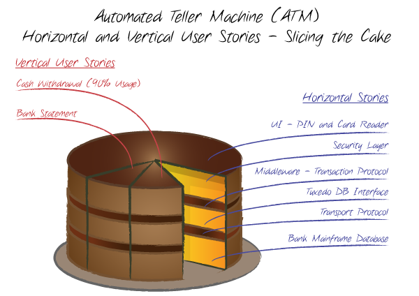

# 7. 优秀用户故事准则

到现在，我们有了一个很好的基础，了解了什么是故事，如何利用拖网式捕捞以及编写故事，如何识别关键的用户角色以及验收测试在其中起到的作用。

下面，我们将了解一些额外的**编写优秀故事的准则**。

## 7.1. 从目标故事开始

在一个大型项目中，尤其是有许多用户角色的项目，"如何确定用户故事"这个事情有时让人**无从下手**。

我发现最好的办法是考虑每一个用户角色，**了解用户使用我们软件的目的**。

例如，思考一下招聘网站例子中的[求职者](../ch3/#什么是用户角色)角色。他的确有一个最高优先级的目标：**找到一份工作**。

但我们可以认为这个目标包括以下目标：

- 搜索他感兴趣的工作(基于他的技能、期望薪资、工作地点等)
- 自动搜索，以便于不用每次都手动搜索
- 让他的简历可见，以便于招聘公司能搜索到他
- 很容易申请他喜欢的任何工作

这些**目标**（实际上是高层次的故事）可以**用来衍生出新的故事**。

## 7.2. 切蛋糕

当面临一个大的故事的时候，通常有许多方法可以将它分解成较小的故事。许多**开发人员首先想到的是将故事按照技术路线分割**。

比如，假设团队觉得故事“求职者可以发布简历”在当前这轮迭代中太大了，就必须分割。开发人员可能想沿着技术边界分割，示例如下：

- 求职者可以填写简历表
- 简历表上的信息被写入数据库

在这个案例中，一个故事会在当前迭代中完成，而另一个故事则（很可能）推迟到下一轮迭代里。这种做法的缺陷是，没有一个故事是单独对用户很有用的。

> 第一个故事说的是求职者可以填写简历表，但数据没有被保持。
>
> 第二个故事说的是从简历表上搜集的数据会写入数据库。如果没有第一个故事提供表格给用户，第二个故事就没有什么价值。

一个更好的办法是换一种方式编写故事，每个故事都提供某种程度的完整（`end-to-end`）的功能。

> Bill Wake（2003a）将其称之为“切蛋糕”(`slicing the cake`)

根据这个**切蛋糕原则**，我们可以把故事“求职者可以发布简历”像下面这样分。

- 求职者可以提交简历，简历上只包括诸如名字、地址、和教育背景这样的基本信息
- 求职者可以提交简历，简历上包括雇主想看的所有信息

在编写用户故事时，更倾向编写像一块完整蛋糕那样功能完整的故事。

具体有两个原因:

- 首先，在开发中，**及早涉及软件应用架构的每一层能够有效地降低最后时刻才发现层次架构方面问题的风险**。
- 其次，尽管不十分完美，**即使只提供部分功能，但只要发布的功能可以跑，就可以放心的把应用程序发布给用户使用**。

## 7.3. 编写封闭的故事

`Soren Laueson(2002)`在他的[《Software Requirements》](https://book.douban.com/subject/2696709/)一书中引入了**任务闭包性**的想法。这个想法统一适用于用户故事。

**一个封闭的故事是指随着一个有意义的目标的实现而结束的故事，能让用户使用后觉得他完成了某个任务**。

例如，假设招聘网站项目包含故事“招聘者可以管理他发的招聘广告”，这不是一个闭合的故事。管理他发布的招聘广告是没有办法彻底完成的事情。相反，它是一个持续进行的活动。

这个故事可以更好的创建成一个闭合故事的集合。

- 招聘者可以审核针对他发布的招聘广告发的简历
- 招聘者可以更改招聘广告的过期日期
- 招聘者可以删除不适合的申请
- ......

这种**封闭的每个故事都是原来那个非封闭故事的一部分**。使用完这些封闭故事之后，用户可能会有一种**成就感**。

**编写封闭故事其实是在互相冲突的各种需求之间权衡的结果**。因为，故事也要小到能做评估，小到可以方便的安排一轮迭代中。

但故事也要足够大（粗颗粒的、高层次的、抽象的），从而避免过早捕获当下还不需要的细节。

## 7.4. 卡片约束

`Newkirk`和`Martin`(2001)推荐过一种实践，我觉得它是很有用的。

他们引入的实践，是对于任何必须遵守而不需要直接实现的故事，在其故事卡上标识“约束”（`constranint`）。

比如这样的故事：

> **约束：** 系统必须支持最大50个并发用户的峰值

其他约束的例子如下：

- 设计的软件要便于今后实现国际化
- 新系统必须使用我们现有的订单数据库
- 该软件必须能在所有版本的`Windows`系统上运行
- 该系统的无故障运行时间要求达到`99.999%`
- 该软件要很好用

尽管约束卡不需要做估算，也不会像普通卡片那样别安排到迭代中，但它们仍然很有用处。至少，可以把约束卡贴在墙上作为提醒。更秒的是，可以编写验收测试来确保系统没有违反约束。

> 例如，为上面的故事编写测不是一件难事。

理想情况下，团队可以在最初几轮迭代中一轮中编写测试，那是系统违反约束的可能性还很小。然后团队可以在后续的迭代中持续运行这些测试。只要可能，就要编写自动化测试来确保系统满足约束。

想进一步了解如何约束请参考[第16章 其他话题](../ch16/)

## 7.5. 根据实现时间来确定故事规模

你想把注意力集中在最需要的地方。通常，这意味着你必须更加关注在不久的将来发生的事情而不是更长远的事情。

对于故事，你可以**根据故事的实现时间跨度写出不同层级的故事**。举例来说，对于接下来几次迭代的故事，将按照可以计划进入这些迭代的大小来写，而更远迭代的故事可能会更大且精确度更低。

> 例如，假设在最高层级上，我们确定BigMoneyJobs网站将包含4个故事。

- 求职者可以发布简历。
- 求职者可以搜索职位空缺。
- 招聘人员可以发布招聘信息。
- 招聘人员可以搜索简历。

**客户决定第一次迭代侧重于允许用户发布简历。只有在添加大量简历发布功能之后，才会关注搜索职位，发布职位空缺和搜索简历**。这意味着项目团队和客户将开始进行关于故事“求职者可以发布简历”的对话。

通过这些对话来扩展这个故事的细节，其他3个高层级的故事将被单独留下。

一个可能的故事列表将变成下面这样。

- 求职者可以向该网站添加新的简历。
- 求职者可以编辑已经在网站上的简历。
- 求职者可以从网站上删除自己的简历。
- 求职者可以将简历状态设置为不活跃。
- 求职者可以将简历设置为隐藏某些雇主。
- 求职者可以看到自己的简历被查看了多少次。

关于发布简历的故事……

- 求职者可以搜索职位空缺。
- 招聘人员可以发布职位空缺。
- 招聘人员可以搜索简历。

在写故事时，**要充分利用故事的灵活性，以便应用于各个层级**。

## 7.5. 不要过早涉及用户界面

困扰软件需求方法的问题之一是将需求与解决方案混在一起。也就是说，在说明一个需求时，也要明确说明或者暗示解决方案，通常这种解决方案就体现在用户界面上。但是这种方式会将需求和解决方案混在一起，无法清晰的将需求表达清楚，并且会在项目前期有大量的用户界面设计的工作需要进行设计和澄清。

作为PO，你会希望尽可能把用户界面和故事分隔开。

> **用户故事示例：** 打印对话框允许用户编辑打印机列表。**用户可以从打印机列表中添加或删除打印机，用户可以通过自动搜索或者手动指定DNS打印机名称或者IP地址添加打印机。高级搜索选项还允许用户在限制指定的IP地址和子网范围内搜索。**

如上面的用户故事示例中就会包含了太多用户界面的细节。这个故事的实现者和用户就会被告知了有打印对话框、打印机列表以及至少4种搜索方式。最终，用户界面细节将不可避免地塞进故事。随着软件变得越来越完整，故事从完全的新功能实现转移到功能的修改或者扩展时，这种情况就会导致产生大量的用户故事或需求变更。

## 7.6. 需求不止故事

尽管用户故事是一种非常灵活的格式，可以很好地描述许多系统的许多功能，但它们并不适用于所有的系统。如果需要以非用户故事的形式描述一些需求(如产品设计原型、PRD等)，那就以相应的产出要求来进行对应的需求制品的生产和输出。

> 例如，用户界面通常使用具有大量界面截图的文档进行描述。

同样，除了用户故事之外，你可能需要文档记录并对重要系统之间的接口达成一致，尤其是有外部供应商参与开发时。

**如果发现系统的某个方面可以从不同格式的需求描述中受益，请使用该格式来描述相应的需求。**

## 7.7. 故事中包括用户角色

如果项目团队已经识别了用户角色，那么他们在编写故事时就应该使用这些角色。因此，不要写成“用户可以发布自己的简历”​，应该写成“求职者可以发布自己的简历”​。

这种差异很小，但以这种方式编写故事会让用户存在于开发人员的头脑中。开发人员不会去思考平淡的、不形象的、可替换的用户，他们会想象真实的、具象的用户，从而开发出满足用户需求的软件。

英国公司Connextra[插图]是极限编程的早期采用者之一，他们在2001年使用简短的模板将角色融入故事中。每个故事都是用以下格式编写的：**我作为（角色）想要（功能）以便（商业价值）**

你可能想试试这个模板或者使用你自己的模板。​“role-feature-reason”这样的模板可以帮助区分重要的和无价值的故事。

## 7.8. 为一个用户编写故事

如果只为单个用户编写故事，故事通常最具有可读性。对于许多故事来说，为一个或者多个用户编写不会有什么差异。但是，对于某些故事，差异可能很大。例如，考虑一下“求职者可以从网站上删除简历”这个故事。这可以解释为，一个求职者可以删除自己的简历，也可能删除其他人的简历。

通常情况下，**当你在心中只考虑一个单独用户的故事时，这类问题就会变得清晰起来**。

例如，上面的故事可以写成“求职者可以删除简历”​。当写成这样时，一个求职者可能会删除其他人简历的问题就变得更加明显，所以故事可以进一步改写为“求职者可以删除自己的简历”​。

## 7.9. 用主动语态

主动语态就像直接走向目的地--清晰、有活力，通常因其简单明了而备受青睐。它非常适合大多数类型的交流，让你的句子听起来自信而充满活力。

> 示例：香料[宾语]被小贩[主语]卖掉了[动词]：
> 公式：宾语[动作的执行者]+动词[动作]+主语[动作的接受者]。
> 在这里，"香料 "成为重点，而小贩在句子中处于次要地位。

用户故事最好使用主动语态来编写，更易于团队和用户来阅读和理解用户故事，能够形成讨论，并达成对用户故事的一致的认知。

> 例如，不要说“简历可以被求职者发布”​，而应该说“求职者可以发布简历”​。

## 7.10. 客户编写故事

理想情况下，客户会编写故事。

在许多项目中，开发人员可以帮忙编写故事，要么在最初的故事编写工作坊中实际编写，要么向客户建议新的故事。但是，编写故事的责任就在于客户了，而不能很便捷的传递给开发人员。

此外，由于客户有责任确定每次迭代的故事优先顺序，因此客户了解每个故事至关重要。做到这一点的最好方法就是客户亲自把故事写出来，但现实情况下是比较难的意见事情，需要我们的PO非常善于挖掘用户需求，并通过条目化的用户故事来客户来确认故事的优先顺序。

## 7.11. 不要给故事卡编号

> 该准则仅适用于使用卡片来编写故事的实践方式。

我们第一次使用故事卡时，许多人都想要给卡片进行编号。通常的理由是，这将有助于跟踪个别卡片或者为故事添加一定程度的可追溯性。

> 例如，当我们发现卡片13上的故事太大时，我们就撕掉卡片13，并用卡片13.1，13.2和13.3替换它。然而，给故事卡编号给流程增加了无谓的开销，并会导致我们抽象地讨论需要形象化的特性。

我宁愿讨论“故事添加用户组”​，也不想讨论“故事13”​，特别不想讨论“故事13.1”​。如果觉得不得不对故事卡进行编号，可以尝试在卡片上添加一个简短的标题，并在其他的故事文本中使用这个标题的简写。

## 7.12. 不要忘记目的

不要忘记，故事卡的主要目的是提示人们讨论该特性。需要注意保持故事的简短性，不要向故事卡中添加更多细节，用它来取代团队的对话讨论。

## 扩展阅读

- [Slicing the Cake - User story slicing](http://tracks.roojoom.com/r/1757)
- [Slicing your development as a multi-layer cake -- Luis Fernando Mizutani](http://www.linkedin.com/pulse/slicing-cake-useful-guidelines-breakdown-development-work-mizutani)
- [Slicing Stories - Agile Business Conference](https://www.agileconference.org/wp-content/uploads/2015/10/How-to-Slice-Product-Backlog-Items-Matt-Roadnight-v1-2.pdf)
- [Software Requirements: Styles & Techniques -- Soren Lauesen](https://www.pearson.com/us/higher-education/program/Lauesen-Software-Requirements-Styles-Techniques/PGM11471.html)
